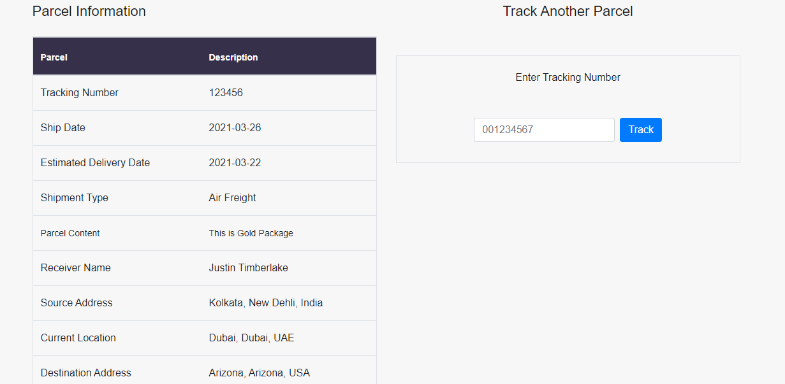

## Shipping and Courrier Service Application

This project is an implementation of a courier and shipping website with features like package tracking, admin-backend, and user-frontend that was built fully with PHP, HTML, and CSS3.

## Built With

- HTML
- CSS3
- JavaScript/ES6
- Webpack
- PHP

## Live Demo

[Live Demo Link](http://flight.learningo.club/index.php)

## Getting Started

To get a local copy  and to set it up and running follow these simple example steps.

### Prerequisites

- Browser
- Internet

- Download the code from repository (https://github.com/happiguru/shipping_courier_services).

## Authors

👤 **Stanley Enow Lekunze**

- Github: [@happiguru](https://github.com/happiguru)
- Twitter: [@Lekunze_Nley](https://twitter.com/Lekunze_Nley)
- Linkedin: [lekunze-nley](https://www.linkedin.com/in/lekunze-nley/)

## Show your support

Give a ⭐️ if you like this project!

## Acknowledgments
-This project gave us a better understanding of the visual properties that must be used on a website.

## 📝 License

This project is [MIT](LICENSE) licensed.

